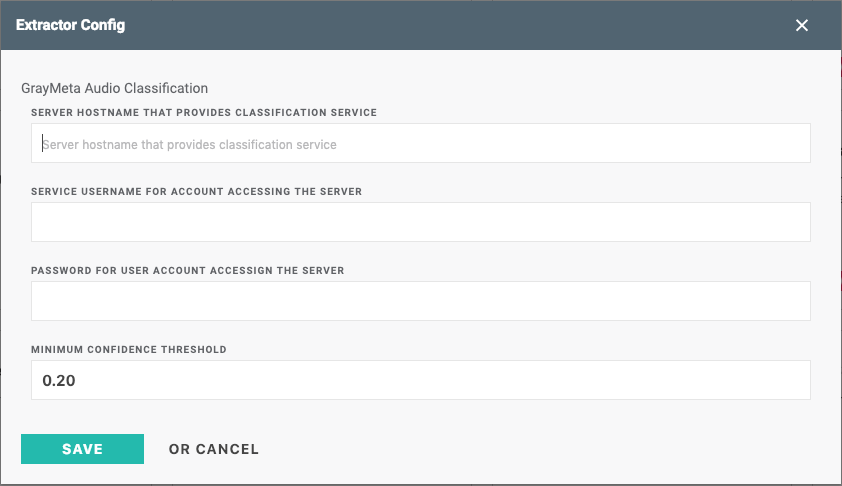

# Graymeta Machine Learning services
This is optional but is required if you want to use any Graymeta Machine Learning services.

**NOTE:** *The first module below is required to setup an internal load balancer to the different ML services.*

**UPGRADE:** *If upgrading Faces from v0.1.4 or lower make sure you copy the `RDS Configuration` to the new module and that the module name does not change.  Also credits and slates were included with the old faces module.  Now they are seperate modules and make sure you update the endpoint/hostname in the extractor config.*


```
# ml_network - (Required) if installing any Graymeta ML services.
module "ml_network" {
  source = "github.com/graymeta/terraform-aws-platform//modules/ml_services/ml_network?ref=v0.1.10"

  key_name               = "${local.key_name}"
  log_retention          = "${local.log_retention}"
  mlservices_subnet_id_1 = "${module.network.mlservices_subnet_id_1}"
  mlservices_subnet_id_2 = "${module.network.mlservices_subnet_id_2}"
  platform_instance_id   = "${local.platform_instance_id}"
  proxy_endpoint         = "${module.network.proxy_endpoint}"
  ssh_cidr_blocks        = "${local.ssh_cidr_blocks}"
}

# audio - (Optional) GrayMeta Audio Classification extractor.
module "audio" {
  source = "github.com/graymeta/terraform-aws-platform//modules/ml_services/audio?ref=v0.1.10"

  instance_type          = "m5.large"
  max_cluster_size       = "2"
  min_cluster_size       = "1"
  ml_loadbalancer_output = "${module.ml_network.ml_loadbalancer_output}"
  services_ecs_cidrs     = ["${module.network.ecs_cidrs}", "${module.network.services_cidrs}"]
}

output "audio_endpoint" {
  value = "${module.audio.endpoint}"
}

# credits - (Optional) Credits extractor
module "credits" {
  source = "github.com/graymeta/terraform-aws-platform//modules/ml_services/credits?ref=v0.1.10"

  instance_type          = "m5.large"
  max_cluster_size       = "2"
  min_cluster_size       = "1"
  ml_loadbalancer_output = "${module.ml_network.ml_loadbalancer_output}"
  services_ecs_cidrs     = ["${module.network.ecs_cidrs}", "${module.network.services_cidrs}"]
}

output "credits_endpoint" {
  value = "${module.credits.endpoint}"
}

# faces - (Optional) GrayMeta Facial Recognition extractor.  The endpoint is configured in platform module.
# Please set `rds_snapshot = "final"` after your initial deployment.
module "faces" {
  source = "github.com/graymeta/terraform-aws-platform//modules/ml_services/faces?ref=v0.1.10"

  instance_type          = "m5.large"
  max_cluster_size       = "2"
  min_cluster_size       = "1"
  ml_loadbalancer_output = "${module.ml_network.ml_loadbalancer_output}"
  services_ecs_cidrs     = ["${module.network.ecs_cidrs}", "${module.network.services_cidrs}"]

  # RDS Information
  rds_backup_retention  = "14"
  rds_backup_window     = "03:00-04:00"
  rds_db_instance_size  = "db.r4.2xlarge"
  rds_db_password       = "mydbpassword"
  rds_db_username       = "mydbuser"
  rds_snapshot          = "" # Set to "final" after the initial deployment
  rds_subnet_id_1       = "${module.network.rds_subnet_id_1}"
  rds_subnet_id_2       = "${module.network.rds_subnet_id_2}"
}

# nld - (Optional) Natural Language Description extractor.
module "nld" {
  source = "github.com/graymeta/terraform-aws-platform//modules/ml_services/nld?ref=v0.1.10"

  instance_type          = "m5.large"
  max_cluster_size       = "2"
  min_cluster_size       = "1"
  ml_loadbalancer_output = "${module.ml_network.ml_loadbalancer_output}"
  services_ecs_cidrs     = ["${module.network.ecs_cidrs}", "${module.network.services_cidrs}"]
}

output "nld_endpoint" {
  value = "${module.nld.endpoint}"
}

# object - (Optional) GrayMeta Object Detection extractor.
module "object" {
  source = "github.com/graymeta/terraform-aws-platform//modules/ml_services/object?ref=v0.1.10"

  instance_type          = "m5.large"
  max_cluster_size       = "2"
  min_cluster_size       = "1"
  ml_loadbalancer_output = "${module.ml_network.ml_loadbalancer_output}"
  services_ecs_cidrs     = ["${module.network.ecs_cidrs}", "${module.network.services_cidrs}"]
}

output "object_endpoint" {
  value = "${module.object.endpoint}"
}

# slates - (Optional) Slates extractor.
module "slates" {
  source = "github.com/graymeta/terraform-aws-platform//modules/ml_services/slates?ref=v0.1.10"

  instance_type          = "m5.large"
  max_cluster_size       = "2"
  min_cluster_size       = "1"
  ml_loadbalancer_output = "${module.ml_network.ml_loadbalancer_output}"
  services_ecs_cidrs     = ["${module.network.ecs_cidrs}", "${module.network.services_cidrs}"]
}

output "slates_endpoint" {
  value = "${module.slates.endpoint}"
}

# vssoccer - (Optional) Graymeta Visual Sports Soccer extractor
module "vssoccer" {
  source = "github.com/graymeta/terraform-aws-platform//modules/ml_services/vssoccer?ref=v0.1.10"

  instance_type          = "m5.large"
  max_cluster_size       = "2"
  min_cluster_size       = "1"
  ml_loadbalancer_output = "${module.ml_network.ml_loadbalancer_output}"
  services_ecs_cidrs     = ["${module.network.ecs_cidrs}", "${module.network.services_cidrs}"]
}

output "vssoccer_endpoint" {
  value = "${module.vssoccer.endpoint}"
}
```

## Configure extractors
For the Graymeta ML Services we need to add the following variables to the platform module.  
* `mlservices_endpoint` is required for any of the above ML Services.
* `faces_endpoint` is required for GrayMeta Facial Recognition extractor

```
module "platform" {
  source = "github.com/graymeta/terraform-aws-platform?ef=v0.1.10"
  ...
  mlservices_endpoint = "${module.ml_network.endpoint}"
  faces_endpoint = "${module.faces.faces_endpoint}"
  ...
}
```

After the `terraform apply` you will get the endpoint as part of the output.  Go into the Platform UI under Settings -> Extractors.
Configure the extractors and add the endpoint to the hostname field.  The credentials can be blank since they will not be used.

