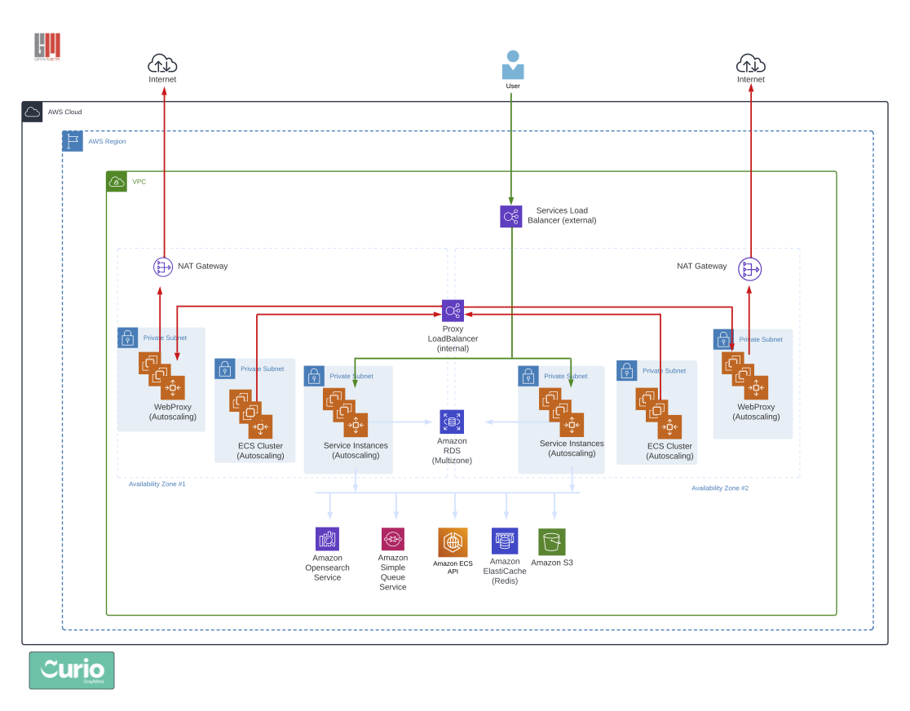

# Deploying GrayMeta Platform with Terraform

Available on the [Terraform Registry](https://registry.terraform.io/modules/graymeta/platform/aws)



* `version` - Current version is `v0.2.6`
* Terraform 11 is only supported at this time.
* Access to GrayMeta Curio AMI's for deployment - Contact support@graymeta.com.
* Once successfully deployed, contact support@graymeta.com to license your product
* No AWS Root user security context should be used in the deployment of any/all Iris Anywhere services. Please follow the policy of [least privilege](https://docs.aws.amazon.com/IAM/latest/UserGuide/best-practices.html#grant-least-privilege) for all access granted as part of the deployment.

### Deployment Duration
New customers can expect deployment duration to last 2-3 hours.  Existing customers who have all pre-determined configurations in place can expect a deployment duration of 30 mins.

### Specialized Knowledge
* IAC
  * Terraform - specifically versions 0.11.14 and 0.11.15
* AWS Services familiarity with...
  * IAM (Free Service)
    * Create necessary profile(s)
    * Create keys
  * Route53 (Billable Service)
  * EC2 (Billable Service)
    * Specific compute needs  
  * RDS (Billable Service)
  * ECS (Free Service)
  * Elasticache - Redis (Billable Service)
  * OpenSearch/ElasticSearch (Billable Service)
  * S3 (Billable Service)
  * ACM (Free Service)
  * VPC/Networking (Free Service with optional Billable VPC services)
  * NAT Gateway (Billable Service)
  * Amazon Rekognition (Billable Service)
  * SQS (optional) (Billable Service)

### Sensitive Data
User sensitive data will be stored/retrieved from the following...
  * AWS Opensearch/Elasticsearch
  * RDS/Postgres
  * S3
  * Terraform root module where configurations are set
  * Redis for cached data

### Variable Definitions
* `customer` - Short name for you company.
* `platform_instance_id` - Pick a _platform instance id_ for this deployment of the GrayMeta platform. A short, descriptive name like `production`, `labs`, `test`, etc. that can be used to uniquely identify this deployment of the GrayMeta Platform within your environment.
* `notifications_from_addr` - Decide what email address will be used as the `From:` address for email notifications generated by the platform. You must use a [Verified SES email address](http://docs.aws.amazon.com/ses/latest/DeveloperGuide/verify-email-addresses.html) for this address.  Submit a request to [move out of the SES sandbox](http://docs.aws.amazon.com/ses/latest/DeveloperGuide/request-production-access.html).
* `notifications_region` - If you are using SES in a different region set the region here.  You can leave blank if SES is in the same region as the platform.
* `dns_name` - Pick the hostname which will be used to access the platform (example: graymeta.example.com). Record this value as the `dns_name` variable.
* `region` - Pick which AWS region you want to deploy into from the list below:
  * us-east-1
  * us-east-2
  * us-west-2
  * ap-southeast-2
  * eu-west-1
* `az1` and `az2` - Pick the availablity zones to deploy in.
* Decide the CIDR or CIDRs that will be allowed access to the platform. Record as comma delimited lists of CIDR blocks.
  * `platform_access_cidrs` - The list of CIDRs that will be allowed to access the web ports of the platform
  * `ssh_cidr_blocks` - The list of CIDRs that will be allowed SSH access to the servers. This is typically an admin or VPN subnet somewhere within your VPC.
* `key_name` - The default ssh key name to access the instances.
* `gm_license_key` - Contact support@graymeta.com if you have not been provided a license key.  Please include your `dns_name` in your request for a license.  If you add this variable to your `encrypted_config_blob` then you can set this to empty string. `gm_license_key = ""`
* `ssl_certificate_arn` - Procure a valid SSL certificate for the hostname chosen in the previous step. Self-signed certificates will NOT work. Upload the SSL certificate to Amazon Certificate Manager in the same region you will be deploying the platform into.  After upload, record the ARN of the certificate as variable ssl_certificate_arn
* `file_storage_s3_bucket_arn` - Create an S3 bucket to store thumbnails, transcoded video and audio preview files, and metadata files.  Record the ARN of the s3 bucket as variable file_storage_s3_bucket_arn.
* `usage_s3_bucket_arn` - Create an S3 bucket to store usage reports. Record the ARN of the s3 bucket as variable `usage_s3_bucket_arn`.
* `log_retention` - The log retention set in Cloudwatch for all logs.

### Additional Notes
* The default network will be `10.0.0.0/16`.  Currently you must use our network module to create the network since it is also creating a Proxy cluster for added security of outbound traffic.  If you would like to use a different network address block, please review the [Networking Module Readme](README-networking.md)
* Secrets are already encrypted by the platform.  Decide if you want the RDS encrypted at rest.   To encrypt change `db_storage_encrypted` to true.  If you leave `db_kms_key_id` blank it will create a kms key for you.  To specify an existing KMS Key add the ARN to `db_kms_key_id`.  These settings are ignored after creation.

### Terraform Deployment
* Fill in the rest of the variables, review the output of a `terraform plan`, then apply the changes.
* After the apply.  Create a CNAME from your `dns_name` to the value of the `GrayMetaPlatformEndpoint` output. This needs to be publicly resolvable.
* Load `https://dns_name` where _dns\_name_ is the name you chose above. The default username is `admin@graymeta.com`. The password is set to the instance ID of one of the Services nodes of the platform. These are tagged with the name `GrayMetaPlatform-${platform_instance_id}-Services` in the EC2 console. There should be at least 2 nodes running. Try the instance ID of both. After logging in for the first time, change the password of the `admin@graymeta.com` account. Create other accounts as necessary.
* After the initial install it is recommended to change `db_snapshot = "final"`.  If the database is destroyed this will use the final snapshot when recreating the database.

## Example
```
provider "aws" {
  region  = "us-west-2"
  version = "~> 1.16"
}

locals {
  customer                   = "mycompanyname"
  platform_instance_id       = "labs"
  notifications_from_addr    = "noreply@example.com"
  dns_name                   = "foo.cust.graymeta.com"
  region                     = "us-west-2"
  az1                        = "us-west-2a"
  az2                        = "us-west-2b"
  platform_access_cidrs      = "0.0.0.0/0"
  ssh_cidr_blocks            = "10.0.0.0/24,10.0.1.0/24"
  key_name                   = "somekey"
  gm_license_key             = "Contact Graymeta Support for license"
  ssl_certificate_arn        = "arn:aws:acm:us-west-2:111111111111:certificate/11111111-1111-1111-1111-111111111111"
  file_storage_s3_bucket_arn = "arn:aws:s3:::cfn-file-api"
  usage_s3_bucket_arn        = "arn:aws:s3:::cfn-usage-api"
  log_retention              = "14"
}

module "servicesiam" {
  source = "github.com/graymeta/terraform-aws-platform//modules/servicesiam?ref=v0.2.6"

  platform_instance_id = "${local.platform_instance_id}"
}

module "network" {
  source = "github.com/graymeta/terraform-aws-platform//modules/network?ref=v0.2.6"

  az1                  = "${local.az1}"
  az2                  = "${local.az2}"
  dns_name             = "${local.dns_name}"
  key_name             = "${local.key_name}"
  platform_instance_id = "${local.platform_instance_id}"
  region               = "${local.region}"
  ssh_cidr_blocks      = "${local.ssh_cidr_blocks}"

  # Proxy Cluster Configuration
  proxy_instance_type    = "m5.large"
  proxy_max_cluster_size = 2
  proxy_min_cluster_size = 1
  proxy_scale_down_thres = "250000000" # 2Gb/s
  proxy_scale_up_thres   = "875000000" # 7Gb/s
  
  # Statsite
  statsite_instance_type       = "m5.large"
  statsite_volume_size         = "100"
}


module "platform" {
  source = "github.com/graymeta/terraform-aws-platform?ref=v0.2.6"

  customer                = "${local.customer}"
  dns_name                = "${local.dns_name}"
  key_name                = "${local.key_name}"
  log_retention           = "${local.log_retention}"
  notifications_from_addr = "${local.notifications_from_addr}"
  notifications_region    = ""
  platform_instance_id    = "${local.platform_instance_id}"
  region                  = "${local.region}"
  ssl_certificate_arn     = "${local.ssl_certificate_arn}"

  # Access
  platform_access_cidrs = "${local.platform_access_cidrs}"
  ssh_cidr_blocks       = "${local.ssh_cidr_blocks}"

  # Bucket Information
  file_storage_s3_bucket_arn = "${local.file_storage_s3_bucket_arn}"
  usage_s3_bucket_arn        = "${local.usage_s3_bucket_arn}"

  # RDS Configuration
  db_allocated_storage = "100"
  db_backup_retention  = "0"
  db_backup_window     = "03:00-04:00"
  db_instance_size     = "db.t2.small"
  db_kms_key_id        = ""
  db_multi_az          = true
  db_password          = "mydbpassword"
  db_snapshot          = "" # Set to "final" after the initial deployment
  db_storage_encrypted = false
  db_username          = "mydbuser"
  db_version           = "12"

  # ECS Cluster Configuration
  ecs_instance_type    = "c4.large"
  ecs_max_cluster_size = 4
  ecs_min_cluster_size = 1
  ecs_volume_size      = 1000

  # Services Cluster Configuration
  services_iam_role_name    = "${module.servicesiam.services_iam_role_name}"
  services_instance_type    = "m4.large"
  services_max_cluster_size = 4
  services_min_cluster_size = 2

  # Encryption Tokens - 32 character alpha numberic strings
  client_secret_fe            = "012345678901234567890123456789ab"
  client_secret_internal      = "012345678901234567890123456789ab"
  encryption_key              = "012345678901234567890123456789ab"
  encrypted_config_blob       = ""
  jwt_key                     = "012345678901234567890123456789ab"
  oauthconnect_encryption_key = "012345678901234567890123456789ab"
  gm_license_key              = "${local.gm_license_key}"

  # Elasticache Configuration
  elasticache_instance_type_services = "cache.m4.xlarge"

  # ElasticSearch Configuration
  elasticsearch_dedicated_master_count = "3"
  elasticsearch_dedicated_master_type  = "m4.xlarge.elasticsearch"
  elasticsearch_instance_count         = "2"
  elasticsearch_instance_type          = "m4.xlarge.elasticsearch"
  elasticsearch_volume_size            = "100"

  # Network Configuration
  az1_nat_ip                = "${module.network.az1_nat_ip}/32"
  az2_nat_ip                = "${module.network.az2_nat_ip}/32"
  ecs_subnet_id_1           = "${module.network.ecs_subnet_id_1}"
  ecs_subnet_id_2           = "${module.network.ecs_subnet_id_2}"
  elasticsearch_subnet_id_1 = "${module.network.elasticsearch_subnet_id_1}"
  elasticsearch_subnet_id_2 = "${module.network.elasticsearch_subnet_id_2}"
  proxy_asg                 = "${module.network.proxy_asg}"
  proxy_endpoint            = "${module.network.proxy_endpoint}"
  public_subnet_id_1        = "${module.network.public_subnet_id_1}"
  public_subnet_id_2        = "${module.network.public_subnet_id_2}"
  rds_subnet_id_1           = "${module.network.rds_subnet_id_1}"
  rds_subnet_id_2           = "${module.network.rds_subnet_id_2}"
  services_subnet_id_1      = "${module.network.services_subnet_id_1}"
  services_subnet_id_2      = "${module.network.services_subnet_id_2}"
  statsite_ip               = "${module.network.statsite_ip}"
  statsite_nsg              = "${module.network.statsite_nsg}"

  # AWS Rekognition Custom Labels Configuration
  aws_cust_labels_bucket          = "somebucket"
  aws_cust_labels_inference_units = "1"

  # (Optional) Error Reporting Configurations
  rollbar_token = ""

  # (Optional) Google maps - for plotting geocoded results on a map in the UI
  google_maps_key = ""

  # (Optional) logograb
  logograb_key = ""

  # (Optional) Segment.com Analytics Write Key. Set to an empty string to disable analytics.
  segment_write_key = ""

  # (Optional) s3 notification
  s3subscriber_priority   = ""
  sqs_s3notifications_arn = ""
  sqs_s3notifications     = ""

  # (Optional) Harvest complete fields
  harvest_complete_stow_fields = ""

  # (Optional) Graymeta ML Services
  # if not deploying GrayMeta ML Service uncomment the below and deploy empty array
  # mlservices_endpoint = "${module.ml_network.endpoint}"

  # (Optional) Graymeta Faces Extractor
  # if not deploying GrayMeta Faces uncomment the below and deploy empty array
  # faces_endpoint = "${module.faces.faces_endpoint}"

  # (Optional) Celebrity detection
  gm_celeb_detection_enabled        = "false"
  gm_celeb_detection_interval       = "5m"
  gm_celeb_detection_min_confidence = "0.6"
  gm_celeb_detection_provider       = "gmceleb"

  # (Optional) OAuth-storage
  box_com_client_id        = ""
  box_com_secret_key       = ""
  dropbox_app_key          = ""
  dropbox_app_secret       = ""
  dropbox_teams_app_key    = ""
  dropbox_teams_app_secret = ""

  # (Optional) SAML Configuration
  saml_attr_email       = "email"
  saml_attr_firstname   = "firstname"
  saml_attr_lastname    = "lastname"
  saml_attr_uid         = "uid"
  saml_cert             = ""
  saml_idp_metadata_url = ""
  saml_key              = ""
}

output "GrayMetaPlatformEndpoint" {
    value = "${module.platform.GrayMetaPlatformEndpoint}"
}

# This is to share the usage bucket and contents with Graymeta.
module "share_usage" {
  source = "github.com/graymeta/terraform-aws-platform//modules/usage?ref=v0.2.6"

  usage_s3_bucket_arn = "${local.usage_s3_bucket_arn}"
}

resource "aws_s3_bucket_public_access_block" "file_s3_bucket" {
  bucket                  = "${local.file_storage_s3_bucket_arn}"
  block_public_acls       = true
  block_public_policy     = true
  ignore_public_acls      = true
  restrict_public_buckets = true
}

resource "aws_s3_bucket_public_access_block" "usage_s3_bucket" {
  bucket                  = "${local.usage_s3_bucket_arn}"
  block_public_acls       = true
  block_public_policy     = true
  ignore_public_acls      = true
  restrict_public_buckets = true
}
```

### Test Your Deployment
Upon successful `terraform apply` take the following steps to insure a successful deployment...
* Step 1 - Wait approximately 15 minutes for the DNS record to propagate.
* Step 2 - Enter your previously created CNAME into your browser.
* Step 3 - If successful, you should land at the login page.
* Step 4 - Login credentials can be obtained from your graymeta representative.
* Step 5 - If you are able to login successfully, your curio app has been successfully installed!

### Health Check
AWS Cloudwatch alarms are deployed as part of the Graymeta terraform deployment.  Cloudwatch will alert the administrative users to any instabilities.

### Backup and Recovery
This Graymeta Curio deployment will produce backup snapshots of all databases, metadata2 files, main frames, and other files written to S3.  No further action is needed to backup critical data.

### Common Deployment Issues
The most common customer deployment issue we see is an unfamiliarity with terraform.  For this issue or any other challenges, please contact support@graymeta.com. 

### Routine Maintenance
The terraform code may need to be modified from time to time to maintain a rotating key schedule or launch a newer version of the curio platform.  Entering the new keys in the terraform code and executing a `terraform apply` will restart the Graymeta services and implement the new keys.  However, with a curio platform upgrade, a `terraform destroy`, `terraform init`, `terraform plan`, and `terraform apply` may be required.  Please contact support@graymeta.com for all your support needs.

### AWS Quotas & Service Limits
Select an AWS service to view it's service limits.
* [IAM](https://docs.aws.amazon.com/IAM/latest/UserGuide/reference_iam-quotas.html)
* [Route 53](https://docs.aws.amazon.com/Route53/latest/DeveloperGuide/DNSLimitations.html)
* [EC2](https://docs.aws.amazon.com/AWSEC2/latest/UserGuide/ec2-resource-limits.html)
* [RDS](https://docs.aws.amazon.com/AmazonRDS/latest/UserGuide/CHAP_Limits.html)
* [ECS](https://docs.aws.amazon.com/AmazonECS/latest/developerguide/service-quotas.html)
* [ElastiCache/Redis](https://docs.aws.amazon.com/AmazonElastiCache/latest/red-ug/quota-limits.html)
* [OpenSearch/ElasticSearch](https://docs.aws.amazon.com/opensearch-service/latest/developerguide/limits.html)
* [S3](https://docs.aws.amazon.com/AmazonS3/latest/userguide/BucketRestrictions.html)
* [ACM](https://docs.aws.amazon.com/acm/latest/userguide/acm-limits.html)
* [VPC](https://docs.aws.amazon.com/vpc/latest/userguide/amazon-vpc-limits.html)
* [NAT Gateway](https://docs.aws.amazon.com/vpc/latest/userguide/vpc-nat-gateway.html)
* [Amazon Rekognition](https://docs.aws.amazon.com/rekognition/latest/dg/limits.html)
* [SQS](https://docs.aws.amazon.com/AWSSimpleQueueService/latest/SQSDeveloperGuide/sqs-quotas.html)

### Emergency Maintenance
The Curio platform has been designed to be highly reproducible.  If ever a fault condition was found, whether it be hardware or software, the curio platform could be destroyed and fully recovered from the backup snapshots.  Prior to taking action, please contact support@graymeta.com for a full analysis.

### Graymeta Support
Graymeta provides 1 support tier.  Please contact support@graymeta.com for any support needs.

### Graymeta Service-Level Agreement
Each customer has different needs and will be provided a unique SLA that best suits their business requirements.

### Cost Structure
A instance license for Curio supports unlimited users and is an annually reoccurring license fee.  Depending on the deployment type (saas vs. self-managed) there are different content ingest thresholds.  The GrayMeta core ML suite are included with the license and any additional ML capability (3rd party ML) customer must provide their own keys to supported services.