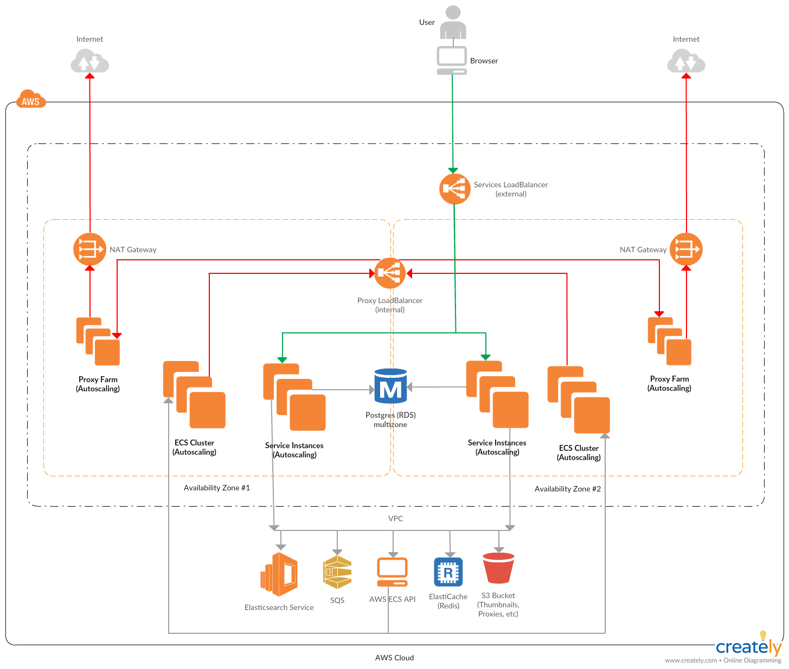

# Deploying GrayMeta Platform with Terraform

Available on the [Terraform Registry](https://registry.terraform.io/modules/graymeta/platform/aws)

 

### Variable Definitions
* `version` - Current version is `v0.1.0`
* `customer` - Short name for you company.
* `platform_instance_id` - Pick a _platform instance id_ for this deployment of the GrayMeta platform. A short, descriptive name like `production`, `labs`, `test`, etc. that can be used to uniquely identify this deployment of the GrayMeta Platform within your environment.
* `notifications_from_addr` - Decide what email address will be used as the `From:` address for email notifications generated by the platform. You must use a [Verified SES email address](http://docs.aws.amazon.com/ses/latest/DeveloperGuide/verify-email-addresses.html) for this address. Make sure you verify the address in the AWS region into which you will deploy the platform. Submit a request to [move out of the SES sandbox](http://docs.aws.amazon.com/ses/latest/DeveloperGuide/request-production-access.html).
* `dns_name` - Pick the hostname which will be used to access the platform (example: graymeta.example.com). Record this value as the `dns_name` variable.
* `region` - Pick which AWS region you want to deploy into from the list below:
  * us-east-1
  * us-east-2
  * us-west-2
  * ap-southeast-2
  * eu-west-1
* `az1` and `az2` - Pick the availablity zones to deploy in.
* Decide the CIDR or CIDRs that will be allowed access to the platform. Record as comma delimited lists of CIDR blocks.
  * `platform_access_cidrs` - The list of CIDRs that will be allowed to access the web ports of the platform
  * `ssh_cidr_blocks` - The list of CIDRs that will be allowed SSH access to the servers. This is typically an admin or VPN subnet somewhere within your VPC.
* `key_name` - The default ssh key name to access the instances.
* `ssl_certificate_arn` - Procure a valid SSL certificate for the hostname chosen in the previous step. Self-signed certificates will NOT work. Upload the SSL certificate to Amazon Certificate Manager in the same region you will be deploying the platform into.  After upload, record the ARN of the certificate as variable ssl_certificate_arn
* `file_storage_s3_bucket_arn` - Create an S3 bucket to store thumbnails, transcoded video and audio preview files, and metadata files.  Record the ARN of the s3 bucket as variable file_storage_s3_bucket_arn.
* `usage_s3_bucket_arn` - Create an S3 bucket to store usage reports. Record the ARN of the s3 bucket as variable `usage_s3_bucket_arn`.
* `log_retention` - The log retention set in Cloudwatch for all logs.
   
### Additional Notes
* The default network will be `10.0.0.0/16`.  Currently you must use our network module to create the network since it is also creating a Proxy cluster for added security of outbound traffic.  If you would like to use a different network address block, please review the [Networking Module Readme](README-networking.md)
* Secrets are already encrypted by the platform.  Decide if you want the RDS encrypted at rest.   To encrypt change `db_storage_encrypted` to true.  If you leave `db_kms_key_id` blank it will create a kms key for you.  To specify an existing KMS Key add the ARN to `db_kms_key_id`.  These settings are ignored after creation.
   
### Terraform Deployment
* Fill in the rest of the variables, review the output of a `terraform plan`, then apply the changes.
* After the apply.  Create a CNAME from your `dns_name` to the value of the `GrayMetaPlatformEndpoint` output. This needs to be publicly resolvable.
* Load `https://dns_name` where _dns\_name_ is the name you chose above. The default username is `admin@graymeta.com`. The password is set to the instance ID of one of the Services nodes of the platform. These are tagged with the name `GrayMetaPlatform-${platform_instance_id}-Services` in the EC2 console. There should be at least 2 nodes running. Try the instance ID of both. After logging in for the first time, change the password of the `admin@graymeta.com` account. Create other accounts as necessary.
* After the initial install it is recommended to change `db_snapshot = "final"`.  If the database is destroyed this will use the final snapshot when recreating the database.

## Example
```
provider "aws" {
    region = "us-west-2"
}

locals {
  version                    = "v0.1.0"
  customer                   = "mycompanyname"
  platform_instance_id       = "labs"
  notifications_from_addr    = "noreply@example.com"
  dns_name                   = "foo.cust.graymeta.com"
  region                     = "us-west-2"
  az1                        = "us-west-2a"
  az2                        = "us-west-2b"
  platform_access_cidrs      = "0.0.0.0/0"
  ssh_cidr_blocks            = "10.0.0.0/24,10.0.1.0/24"
  key_name                   = "somekey"
  ssl_certificate_arn        = "arn:aws:acm:us-west-2:111111111111:certificate/11111111-1111-1111-1111-111111111111"
  file_storage_s3_bucket_arn = "arn:aws:s3:::cfn-file-api"
  usage_s3_bucket_arn        = "arn:aws:s3:::cfn-usage-api"
  log_retention              = "14"
}

module "servicesiam" {
  source = "github.com/graymeta/terraform-aws-platform//modules/servicesiam?ref=${local.version}"

  platform_instance_id = "${local.platform_instance_id}"
}

module "network" {
  source = "github.com/graymeta/terraform-aws-platform//modules/network?ref=${local.version}"

  az1                  = "${local.az1}"
  az2                  = "${local.az2}"
  platform_instance_id = "${local.platform_instance_id}"
  region               = "${local.region}"

  # Proxy Cluster Configuration
  dns_name               = "${local.dns_name}"
  key_name               = "${local.key_name}"
  proxy_instance_type    = "m4.large"
  proxy_max_cluster_size = 2
  proxy_min_cluster_size = 1
  proxy_scale_down_thres = "12500000" # 100 Mb/s
  proxy_scale_up_thres   = "50000000" # 400 Mb/s
  ssh_cidr_blocks        = "${local.ssh_cidr_blocks}"
}


module "platform" {
  source = "github.com/graymeta/terraform-aws-platform?ref=${local.version}"
  
  customer                = "${local.customer}"
  dns_name                = "${local.dns_name}"
  key_name                = "${local.key_name}"
  log_retention           = "${local.log_retention}"
  notifications_from_addr = "${local.notifications_from_addr}"
  platform_instance_id    = "${local.platform_instance_id}"
  region                  = "${local.region}"
  ssl_certificate_arn     = "${local.ssl_certificate_arn}"

  # Access
  platform_access_cidrs = "${local.platform_access_cidrs}"
  ssh_cidr_blocks       = "${local.ssh_cidr_blocks}"

  # Bucket Information
  file_storage_s3_bucket_arn = "${local.file_storage_s3_bucket_arn}"
  usage_s3_bucket_arn        = "${local.usage_s3_bucket_arn}"

  # RDS Configuration
  db_allocated_storage = "100"
  db_backup_retention  = "0"
  db_backup_window     = "03:00-04:00"
  db_instance_size     = "db.t2.small"
  db_kms_key_id        = ""
  db_multi_az          = true
  db_password          = "mydbpassword"
  db_snapshot          = "" # Set to "final" after the initial deployment
  db_storage_encrypted = false 
  db_username          = "mydbuser"

  # ECS Cluster Configuration
  ecs_instance_type    = "c4.large"
  ecs_max_cluster_size = 4
  ecs_min_cluster_size = 1
  ecs_volume_size      = 1000

  # Services Cluster Configuration
  services_iam_role_name    = "${module.servicesiam.services_iam_role_name}"
  services_instance_type    = "m4.large"
  services_max_cluster_size = 4
  services_min_cluster_size = 2

  # Encryption Tokens - 32 character alpha numberic strings
  client_secret_fe       = "012345678901234567890123456789ab"
  client_secret_internal = "012345678901234567890123456789ab"
  encryption_key         = "012345678901234567890123456789ab"
  jwt_key                = "012345678901234567890123456789ab"

  # Elasticache Configuration
  elasticache_instance_type_services = "cache.m4.xlarge"

  # ElasticSearch Configuration
  elasticsearch_dedicated_master_count = "3"
  elasticsearch_dedicated_master_type  = "m4.xlarge.elasticsearch"
  elasticsearch_instance_count         = "2"
  elasticsearch_instance_type          = "m4.xlarge.elasticsearch"
  elasticsearch_volume_size            = "100"

  # Network Configuration
  az1_nat_ip                = "${module.network.az1_nat_ip}/32"
  az2_nat_ip                = "${module.network.az2_nat_ip}/32"
  ecs_subnet_id_1           = "${module.network.ecs_subnet_id_1}"
  ecs_subnet_id_2           = "${module.network.ecs_subnet_id_2}"
  elasticsearch_subnet_id_1 = "${module.network.elasticsearch_subnet_id_1}"
  elasticsearch_subnet_id_2 = "${module.network.elasticsearch_subnet_id_2}"
  proxy_endpoint            = "${module.network.proxy_endpoint}"
  public_subnet_id_1        = "${module.network.public_subnet_id_1}"
  public_subnet_id_2        = "${module.network.public_subnet_id_2}"
  rds_subnet_id_1           = "${module.network.rds_subnet_id_1}"
  rds_subnet_id_2           = "${module.network.rds_subnet_id_2}"
  services_subnet_id_1      = "${module.network.services_subnet_id_1}"
  services_subnet_id_2      = "${module.network.services_subnet_id_2}"

  # (Optional) Error Reporting Configurations
  rollbar_token = ""

  # (Optional) Google maps (for plotting geocoded results on a map in the UI
  google_maps_key = ""

  # (Optional) s3 notification
  s3subscriber_priority   = ""
  sqs_s3notifications_arn = ""
  sqs_s3notifications     = ""

  # (Optional) Harvest complete fields
  harvest_complete_stow_fields = ""

  # (Optional) Graymeta Faces Extractor
  faces_endpoint = ""
}

output "GrayMetaPlatformEndpoint" {
    value = "${module.platform.GrayMetaPlatformEndpoint}"
}
```